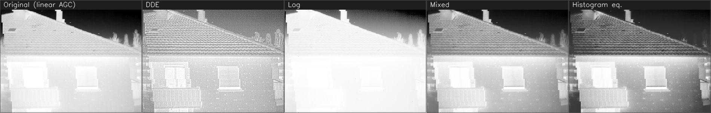
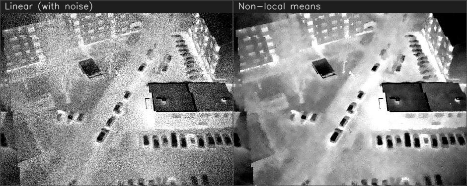
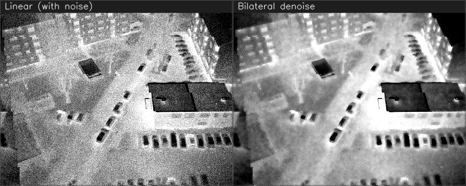
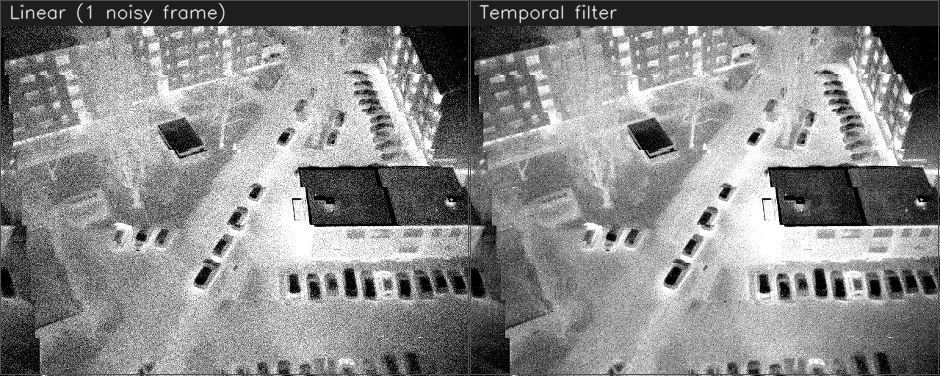
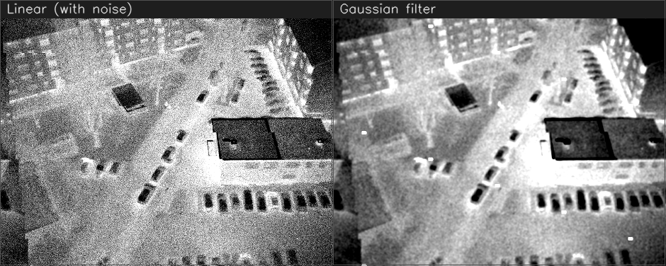
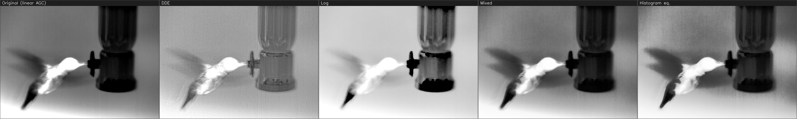
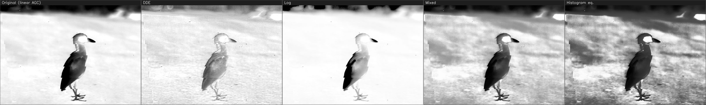
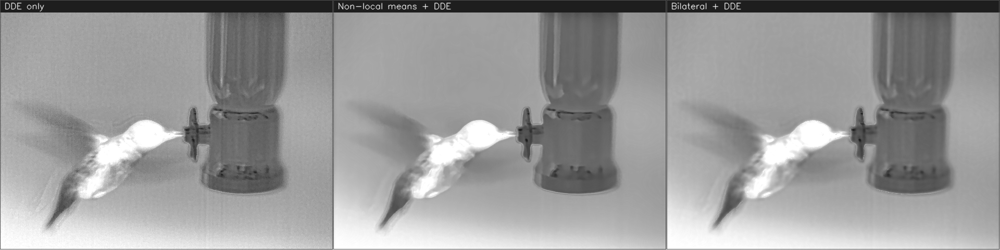

# IrIsp

A Qt desktop demo that turns raw **16-bit infrared** frames into clear 8-bit
images using a detail-preserving contrast enhancement. It plays a raw frame
sequence (or a live 16-bit UVC camera), shows the original and the enhanced
result side by side, and lets you scrub, pause and tune the result in real time.

> Copyright (c) 2026-09-05 Wuhan Wavefront Technology Co., Ltd. All rights reserved.
> wechat:angaio/13707128443

---

## Highlights

IrIsp turns a raw **16-bit infrared** frame into a clear 8-bit image in real
time, through a pipeline you build and tune live in the UI.



*Actual output of the software on a real 16-bit thermal frame: the plain linear
view (far left) crushes the scene, while DDE recovers roof, window and tree
detail at once — without over-exposing the hot window or crushing the cold sky.*

- **Configurable pipeline** — non-uniformity correction · random-noise denoise ·
  fixed-noise denoise · detail-enhancement / tone-mapping, assembled from
  add / remove / reorder nodes, each with its own auto-generated parameter panel.
- **Real-time transport** — play / pause / stop and a smooth-drag progress bar;
  **Original vs. Processed** side by side, or either alone.
- **16-bit histogram** floating panel with the 1% / 99% gray values marked.
- **Recording** — 8-bit **MP4** (H.264) of the current view, and lossless 16-bit
  **FFV1 / MKV**.
- **Protected core** — the enhancement ships as a hardened DLL that exposes only
  numeric ids and names no algorithm (see §5).

Before/after comparisons produced by the software are in §10 (algorithm effects)
and §11 (more real 16-bit samples).

---

## What's new

Recent additions in this build:

- **Frame-by-frame stepping** — step to the previous / next frame with the
  transport buttons or the `,` / `.` keys (file sources).
- **Pipeline is remembered** — the whole pipeline and every node's parameters
  are saved on exit and restored automatically on the next launch.
- **Detail-enhancement presets** — the open detail-enhancement node is split
  into **balanced** and **legacy**, each with its own `Detail` plus
  contrast / plateau controls.
- **De-banding** — the tone-mapping (DDE) node has a `Deband` control that
  removes the contour / stair-step banding strong enhancement can expose on
  smooth gradients.
- **Stronger random-noise denoise** — a second refinement pass for higher
  quality and an optional **GPU (OpenCL)** fast path that falls back to CPU
  automatically; a `Detail` control trades a little denoising back for texture
  to avoid over-smoothing.

All of the above are tuned live from each node's auto-generated parameter panel.

---

## 1. What it does

- Reads infrared input two ways (File menu):
  - **16-bit video** — a `.mkv` (FFV1 / GRAY16LE) written by the RAW recorder, or
    any 16-bit FFV1 file. Close it any time with **File â–¸ Close Video**.
  - **16-bit camera** — a generic 16-bit UVC device. Opening runs on a worker
    thread behind a progress dialog so the UI stays responsive.
- Runs each frame through a **configurable pipeline** you build in the UI. The
  pipeline is an ordered list of nodes; each node applies exactly one algorithm,
  and the frame flows node to node. Algorithms are grouped in four stages:
  - **Non-uniformity correction (NUC)** — two-point NUC
  - **Random-noise denoise** — non-local means · shutterless · bilateral ·
    temporal · gaussian
  - **Fixed-noise denoise** — de-shading
  - **Enhancement** — DDE · log tone mapping · mixed tone mapping · histogram
    equalization
    Add, remove, reorder, enable/disable nodes; every algorithm has its own
    parameter panel, generated automatically.
- **16-bit histogram** floating panel with the 1st- and 99th-percentile gray
  values marked.
- Toolbar: **Snapshot**, **Record MP4** (H.264, records the current view),
  **Record RAW** (lossless 16-bit FFV1/MKV), **Full Screen**.
- Full transport: **play / pause / resume / stop** + a progress bar you can drag
  smoothly to any frame. Side-by-side **Original vs. Processed**, or either alone.

Algorithm identity lives only in the application: the library exposes numeric
ids and generic parameter labels, so the hardened DLL names nothing (see §5).

---

## 2. Architecture

The Qt application (`IrIspDemoApp`) is the only part you compile. The three core
libraries — the enhancement (`IrIspCore`) and the two recorders — are shipped
**prebuilt**: one public header each, plus an import lib and DLL in `bin/`. Their
sources are not part of this distribution.

```
IrIsp/
├─ IrIspDemoApp/        the Qt UI (source) — this is what you build
│  ├─ res/              brand assets (window/exe icon, About logo)
│  └─ src/
├─ IrIspCore/include/IrProcess.h          prebuilt DLL + import lib in bin/
├─ IrMp4Rec/include/IrMp4Recorder.h       prebuilt: 8-bit MP4 (H.264) recorder
├─ IrRaw16Rec/include/IrRaw16Recorder.h   prebuilt: 16-bit FFV1/MKV recorder
├─ bin/                prebuilt DLLs + import libs + IrProcessDemo.exe +
│                      the Qt / OpenCV / FFmpeg runtime (self-contained)
├─ doc/img/            images used by this README
├─ build.bat           one-shot configure + build (edit the two paths at the top)
└─ CMakeLists.txt
```

The application has **no compile-time knowledge of how the enhancement works**.
It builds a pipeline of numeric algorithm ids and pushes 16-bit frames through:

```cpp
auto pipe = IrPipelineFactory::create();
int n = pipe->addNode(30);          // an algorithm id from IrCatalog
pipe->setNodeParam(n, "detail", 60);
pipe->process(src16, dst8);         // per frame -> 8-bit display
```

---

## 3. Environment

To build the application you only need Qt, OpenCV and a C++17 toolchain — the
prebuilt libraries already carry their own dependencies (FFmpeg is baked into the
recorder DLLs).

| Component | Version                       | Notes                                                 |
| --------- | ----------------------------- | ----------------------------------------------------- |
| OS        | Windows 10/11 **x64**         | this is a Windows x64 prebuilt distribution           |
| Qt        | **5.15.2** msvc2019_64        | e.g. `C:\Qt\5.15.2\msvc2019_64`                       |
| OpenCV    | **4.11.0**                    | folder that contains `OpenCVConfig.cmake`             |
| Compiler  | MSVC 2019 or 2022 (v142/v143) | VS 2022 Build Tools is enough                         |
| CMake     | ≥ 3.16                        |                                                       |
| Ninja     | any                           | e.g. `C:\Qt\Tools\Ninja\ninja.exe` (ships with Qt)    |

The bundled DLLs are 64-bit MSVC builds, so use the 64-bit Qt/OpenCV and an x64
toolchain to match.

---

## 4. Build & run

Only the application is compiled; the three core libraries are already built (in
`bin/`). You need Qt 5.15.2 and OpenCV 4.11 installed (see §3).

**Option A — one-shot script.** Edit the two paths (`QTDIR`, `OPENCV_DIR`) at the
top of `build.bat`, then:

```bat
build.bat
bin\IrProcessDemo.exe
```

`build.bat` configures with Ninja, builds Release into `bin\`, and (if the paths
are set) runs `windeployqt` so `bin\` is self-contained.

**Option B — CMake by hand.** From a *x64 Native Tools* command prompt:

```bat
cmake -S . -B build -G Ninja -DCMAKE_BUILD_TYPE=Release ^
      -DCMAKE_PREFIX_PATH=C:\Qt\5.15.2\msvc2019_64 ^
      -DOpenCV_DIR=C:\path\to\opencv\build
cmake --build build
bin\IrProcessDemo.exe
```

The build links the prebuilt `IrIspCore` / `IrMp4Rec` / `IrRaw16Rec` import libs
and writes `IrProcessDemo.exe` into `bin\`, next to the DLLs it needs at run time.
The shipped `bin\` also contains a prebuilt `IrProcessDemo.exe`, so you can run it
without building.

### First run

1. **File ▸ Open Video…** and pick a 16-bit `.mkv` (for example one you capture
   with **Record RAW**), or **File â–¸ Connect Camera** for a 16-bit UVC device.
2. Press **Play**. Drag the slider to scrub. Build a pipeline in the **Pipeline**
   panel (e.g. add *DDE enhancement*) and tune its parameters.

---

## 5. Protection scope

`IrIspCore` is built to keep the method out of casual reach, **not** to defeat a
determined reverse engineer:

- Only `IrCatalog` / `IrPipeline` / `IrPipelineFactory` are exported. No
  algorithm name, pipeline stage or tuning symbol appears in the export table;
  the library exposes numeric ids and generic parameter labels only.
- Internal algorithm classes are opaque (`Op10`..`Op33`) so nothing leaks
  through RTTI type descriptors; a string scan of the DLL finds no algorithm
  name.
- Release builds optimise (`/O2`), fold identical code (`/OPT:REF /OPT:ICF`)
  and drop debug data (`/RELEASE /DEBUG:NONE`); on GCC/Clang, hidden visibility
  plus `-s`. (Whole-program `/GL /LTCG` was intentionally dropped — it made some
  translation units compile for minutes on MSVC.)

For stronger guarantees add a commercial packer/obfuscator or move the core to
dedicated hardware.

---

## 6. Input details

### 16-bit video (.mkv)

**File ▸ Open Video…** plays a 16-bit **FFV1-in-Matroska** file — the lossless
format the RAW recorder writes, decoded back to exact 16-bit frames by the
`IrRaw16Reader` in `IrRaw16Rec.dll`. FFV1 is all-intra, so the slider seeks to
any frame. A ThermoAnalyser-style file with both a raw and an 8-bit preview
track is handled too: the GRAY16LE (raw) track is selected automatically.

**File â–¸ Open Recent** lists the last few `.mkv` files opened (persisted across
runs via `QSettings`; most-recent first). Missing files are greyed out and a
file that fails to open is dropped from the list; **Clear Recent** empties it.

### 16-bit camera

**Connect Camera** opens a generic 16-bit UVC device: a true Y16 device is used
as-is, while an 8-bit preview device has its luminance promoted into the 16-bit
domain. Opening runs on a worker thread behind a progress dialog.

> Some thermal modules *open* over plain UVC but deliver black frames because
> their sensor only starts under a vendor SDK; those vendor-specific capture
> backends are not part of this distribution.

---

## 7. Controls

| Control         | Effect                                                                                               |
| --------------- | ---------------------------------------------------------------------------------------------------- |
| Snapshot        | save the current processed frame to`bin/snapshots/*.png`                                           |
| Record MP4      | record the current view (Original / Processed / Side-by-side) to`bin/records/*.mp4` (H.264, 8-bit) |
| Record RAW      | record the untouched 16-bit stream losslessly to`bin/records/*.mkv` (FFV1/GRAY16LE)                |
| Full Screen     | toggle full screen (also F11)                                                                        |
| Play / Pause    | start or hold playback                                                                               |
| Stop            | rewind to the first frame and hold                                                                   |
| Prev / Next frame | step one frame back / forward — buttons or `,` / `.` keys (file only)                    |
| Slider          | scrub to any frame (smooth drag)                                                                     |
| View            | Original · Processed · Side by side                                                                |
| Pipeline panel  | add / remove / reorder nodes; per-node algorithm + parameters; saved on exit, reloaded next launch |
| Histogram panel | 16-bit histogram with 1% / 99% gray-value guides                                                     |

### Pipeline notes

Denoise and fixed-noise nodes transform the 16-bit frame in place; an
enhancement node maps 16-bit to the 8-bit display (put it last). With no
enhancement node the app shows a plain linear view. A node's checkbox bypasses
it without deleting it.

The shipped algorithms are self-contained implementations of each class,
parameterised rather than driven by the globals/calibration files the original
`005-Arith_Standard_Library` versions use; the exact reference ports can be
swapped in behind the same node interface.

---

## 8. Deployment

Ship the contents of `bin\` as-is. It contains `IrProcessDemo.exe`, the three
core DLLs (`IrIspCore.dll`, `IrMp4Rec.dll`, `IrRaw16Rec.dll`), `opencv_world4110.dll`,
the FFmpeg runtime (`avcodec/avformat/avutil/swscale/swresample`), and the Qt
runtime with the `platforms\` / `styles\` / `imageformats\` / `iconengines\`
plugin folders. On the target, install the **VC++ 2015-2022 x64 redistributable**
if it is not already present.

---

## 9. Pipeline in detail (IR ISP)

This section describes the infrared ISP (image signal processing) pipeline and **what each algorithm node does and how to use it**.

> Note: it only describes *what each node does, how to use it, and how its parameters affect the picture* — it does **not** cover any algorithm's internal implementation or design (kept confidential).

### 9.1 Overview

A raw infrared frame is **single-channel 16-bit**. It flows through a pipeline of **nodes**; each node runs exactly **one** algorithm and passes the result to the next. Nodes are grouped into four stages:

| Stage                | Meaning                   | Data   | Purpose                                                                            |
| -------------------- | ------------------------- | ------ | ---------------------------------------------------------------------------------- |
| NUC                  | Non-uniformity correction | 16→16 | Correct the detector's fixed pattern (non-uniformity) to obtain a clean base image |
| Random-noise denoise | Random-noise denoise      | 16→16 | Suppress temporal/spatial random noise                                             |
| Fixed-noise denoise  | Fixed-noise denoise       | 16→16 | Remove fixed low-frequency brightness non-uniformity                               |
| Enhancement          | Enhancement               | 16→8  | Tone mapping; output a displayable 8-bit image                                     |

**Convention:** NUC and the two denoise stages keep the data 16-bit; **the enhancement stage is the terminus**, mapping 16-bit to an 8-bit display image (place it last). With no enhancement node the app falls back to a linear auto-gain view. The left "Original" pane is a linear auto-gain reference of the acquired frame (it does not pass through the pipeline); the right "Processed" pane is the pipeline output.

### 9.2 Data-flow

#### 9.2.1 Overall (matching the Pipeline panel and acquisition/display)

```
  Acquire          NUC             Random denoise        Fixed denoise      Enhancement
  UVC camera  ─▶   Two-point  ─▶   Non-local means /  ─▶ De-shading    ─▶   DDE / Log /
  MKV file         NUC             Shutterless /                            Mixed / Hist-eq
                                   Bilateral /                              tone map
   16bit           16bit          Temporal / Gaussian      16bit               │ 8bit
                                        16bit                                   â–¼
                                                    ┌───────────────────────────────────────────�
                          acquired ─(linear AGC)─▶  │ Original (left) │ Processed (right)         │
                                                    │ histogram / snapshot / recording            │
                                                    └───────────────────────────────────────────┘
```

> Each stage may hold zero or more nodes; nodes can be **added, removed, reordered and toggled**; each node selects **only one** algorithm from that stage. The labels show the bit width flowing between nodes.

#### 9.2.2 Processing one frame (`ProcessThread` → `IrPipeline::process`)

```
 read() ─▶ src16 (16bit) ─┬─ (linear AGC) ─▶ orig8 ─▶ left "Original"
                          ├─ histogram (1%/99%) ─▶ floating histogram panel
                          └─ through the [enabled] nodes (NUC → random → fixed → enhance)
                                                   ─▶ dst8 ─▶ right "Processed" / recording / snapshot
```

- The histogram is computed on the **acquired 16-bit raw frame** (its true dynamic range).
- Processing never modifies the caller's frame (it works on an internal copy).

### 9.3 Execution model

- **Node table:** `IrPipeline` keeps an ordered node table supporting `addNode / insertNode / removeNode / moveNode / setNodeAlgo / setNodeEnabled`.
- **One algorithm per node:** each node holds a single algorithm instance and runs only that one.
- **Parameters:** each node carries its own parameters (initialised from the algorithm's defaults) and can be tuned live.
- **Toggle:** a node can be bypassed without being deleted.
- **Threading:** processing runs on a background thread; the UI pushes the whole node model to the thread, which rebuilds the pipeline, clears temporal state and repaints.
- **Temporal state:** nodes that keep temporal state (NUC, shutterless, temporal filter, DDE) reset automatically on source change / seek / pipeline edit.

### 9.4 Per-node function and parameters

> Bit width: **16→16** keeps the data 16-bit; **16→8** outputs the 8-bit display image. Parameter notes only describe "what raising/lowering it does to the picture."

#### Non-uniformity correction (NUC)

**Two-point NUC (16→16)** — corrects the **fixed pattern (non-uniformity)** caused by pixel-to-pixel response differences, giving a clean base image free of "grid/stripe/mesh" texture; it is the foundation for the denoise and enhancement that follow.

| Parameter | Range  | Default | Effect                                                                     |
| --------- | ------ | ------- | -------------------------------------------------------------------------- |
| Strength  | 0–100 | 70      | Correction strength; higher removes non-uniformity more completely         |
| Response  | 1–60  | 15      | Convergence speed; higher is steadier but slower (needs some scene motion) |

#### Random-noise denoise

**Non-local means (16→16)** — suppresses random noise while preserving edges and detail as much as possible.

| Parameter     | Range  | Default | Effect                                                    |
| ------------- | ------ | ------- | --------------------------------------------------------- |
| Search radius | 1–8   | 3       | Search range; larger denoises more strongly but is slower |
| Patch radius  | 0–3   | 1       | Detail-preservation granularity                           |
| Strength      | 1–100 | 20      | Denoise strength; too high blurs the image                |

**Shutterless correction (16→16)** — suppresses fixed-pattern noise online from a moving scene during shutterless operation (requires scene motion).

| Parameter | Range  | Default | Effect                                |
| --------- | ------ | ------- | ------------------------------------- |
| Strength  | 0–100 | 60      | Suppression strength                  |
| Response  | 1–30  | 10      | Convergence speed; higher is steadier |

**Bilateral denoise (16→16)** — edge-preserving denoise; smooths flat areas without blurring edges.

| Parameter   | Range  | Default | Effect                                                             |
| ----------- | ------ | ------- | ------------------------------------------------------------------ |
| Window      | 3–21  | 7       | Spatial extent; larger is smoother but slower                      |
| Range sigma | 1–200 | 40      | Edge sensitivity; larger is smoother with weaker edge preservation |

**Temporal filter (16→16)** — inter-frame denoise; motion-adaptive to avoid ghosting.

| Parameter    | Range  | Default | Effect                                                            |
| ------------ | ------ | ------- | ----------------------------------------------------------------- |
| Strength     | 0–100 | 60      | Temporal averaging strength; higher is cleaner but risks ghosting |
| Motion guard | 1–100 | 30      | Motion protection; higher resists ghosting more but denoises less |

**Gaussian filter (16→16)** — simple spatial smoothing to quickly suppress fine speckle.

| Parameter | Range | Default | Effect                               |
| --------- | ----- | ------- | ------------------------------------ |
| Radius    | 1–9  | 1       | Smoothing radius; larger is blurrier |

#### Fixed-noise denoise

**De-shading (16→16)** — removes **low-frequency brightness non-uniformity** caused by the lens/optics (the "dome/vignette" effect: bright centre, dark corners).

| Parameter | Range  | Default | Effect                                                                                   |
| --------- | ------ | ------- | ---------------------------------------------------------------------------------------- |
| Scale     | 3–81  | 31      | Working scale; should be larger than the shading scale and smaller than the target scale |
| Strength  | 0–100 | 70      | Suppression strength                                                                     |

#### Enhancement (outputs 8-bit)

**DDE (16→8)** — detail enhancement + tone mapping; compresses the high-dynamic-range 16-bit to 8-bit while boosting local detail, without over-exposing hot regions or crushing cold ones.

| Parameter  | Range      | Default | Effect                                                                             |
| ---------- | ---------- | ------- | ---------------------------------------------------------------------------------- |
| Detail     | 0–100     | 50      | Detail strength                                                                    |
| Brightness | −100–100 | 0       | Overall brightness bias                                                            |
| Scale      | 3–21      | 11      | Detail/background separation scale; larger separates more thoroughly but is slower |

**Log tone mapping (16→8)** — compresses the dynamic range in the log domain; lifts dark areas more uniformly.

| Parameter   | Range      | Default | Effect                                             |
| ----------- | ---------- | ------- | -------------------------------------------------- |
| Compression | 1–100     | 50      | Compression strength; higher lifts dark areas more |
| Brightness  | −100–100 | 0       | Brightness bias                                    |

**Mixed tone mapping (16→8)** — balances global tonality and local contrast.

| Parameter  | Range      | Default | Effect                                                                       |
| ---------- | ---------- | ------- | ---------------------------------------------------------------------------- |
| Blend      | 0–100     | 50      | Balance of tonality vs contrast (0 = more global, 100 = more local contrast) |
| Brightness | −100–100 | 0       | Brightness bias                                                              |

**Histogram equalization (16→8)** — redistributes gray levels by their distribution to maximise contrast, while limiting the dominance of large same-temperature regions.

| Parameter  | Range      | Default | Effect                                                                                   |
| ---------- | ---------- | ------- | ---------------------------------------------------------------------------------------- |
| Plateau    | 1–100     | 20      | How strongly large regions are suppressed; smaller emphasises small-target contrast more |
| Brightness | −100–100 | 0       | Brightness bias                                                                          |

### 9.5 Histogram and interface

- **Histogram panel:** computed on the 16-bit raw frame, auto-scaling the axis to the current frame's actual min/max and marking the 1% / 99% percentile gray values (orange lines); it can be torn off the main window into a floating panel.
- **Interface and confidentiality:** the core library exposes only `IrCatalog` (algorithm id / stage / parameters), `IrPipeline` (node operations + `process`) and `IrPipelineFactory`; algorithm names live only on the application side — `IrIspCore.dll` contains no algorithm names or internal-implementation symbols.

---

## 10. Algorithm effect comparison (real wide-dynamic-range data)

All images below are produced by the software's **actual processing pipeline** on **real, wide-dynamic-range 16-bit thermal frames** from a public dataset. §10.1 (enhancement) uses an oblique aerial shot of a residential house (tiled roof, chimneys, two windows — one warm from heat loss — a balcony and trees, against a cold sky); §10.2 (denoise) uses an aerial car-park scene.

> **Data source & license:** *Aerial and Terrestrial Thermal Images of German Multi-Family Buildings* (Mayer, Z., Epperlein, A., Vollmer, E., Volk, R.), Zenodo — licensed **CC-BY-4.0** (free for commercial use with attribution). The 16-bit radiometric counts were extracted from the drone images `DJI_0339` (house) and `DJI_0299` (car-park) — DJI Zenmuse XT2, 640×512 — with `flirpy`.

### 10.1 Wide-dynamic-range tone mapping (Enhancement)

The raw frame packs a wide temperature range into 16-bit: a plain linear map (Original) washes out the warm wall/window while the roof and trees stay flat. The enhancement nodes compress 16→8 while keeping detail:


| Output                | Observed effect                                                                                                                                                                                                                                 |
| --------------------- | ----------------------------------------------------------------------------------------------------------------------------------------------------------------------------------------------------------------------------------------------- |
| Original (linear AGC) | The warm wall and windows wash out; roof-tile texture and tree branches read flat                                                                                                                                                               |
| DDE                   | Richest local detail — individual roof tiles, window blinds, tree branches and wall texture all emerge; neither the hot window nor the cold sky is over-exposed or crushed (it also amplifies sensor noise, which the denoise stage addresses) |
| Log                   | Uniformly lifts the mid-tones; softer local contrast                                                                                                                                                                                            |
| Mixed                 | Balances global tonality and local contrast; clean overall look                                                                                                                                                                                 |
| Histogram eq.         | Strongest global contrast; the warm window pops, but noise is amplified too                                                                                                                                                                     |

### 10.2 Denoise nodes

The random-noise denoise nodes are **16→16** (they do not output a display image), so each is shown as **before/after on a real, noisy frame** — an aerial car-park scene from the same CC-BY dataset, whose many near-identical vehicles make detail preservation easy to judge — viewed through the neutral linear map. **Left = noisy input, right = after the node.**

> The correction nodes — **two-point NUC**, **shutterless correction** and **de-shading** — remove *hardware* artifacts (detector fixed-pattern noise and lens shading) that a camera-processed image no longer contains, so they cannot be shown honestly on downloaded imagery; their function and parameters are documented in §9.4.

**Non-local means** — random noise is suppressed while vehicle outlines, roof edges and pavement markings stay sharp; the many near-identical cars are exactly the repeated structure non-local means exploits.



**Bilateral denoise** — edge-preserving: flat areas (road, roofs) are smoothed while edges are kept.



**Temporal filter** — inter-frame averaging of a static scene removes the per-frame noise almost entirely while preserving detail.



**Gaussian filter** — quick overall smoothing that suppresses noise but blurs edges too (non-edge-preserving) — the trade-off against NL-means / bilateral is obvious.



---

## 11. Real infrared data — additional 16-bit radiometric samples

To further validate the results on **real wide-dynamic-range infrared data**, two more **640×480, 16-bit raw detector-count (radiometric, not 8-bit)** scenes were run through the **same pipeline**:

- **Hummingbird** (at a feeder): a hot subject (the bird) against a cool background (the glass feeder) — a typical wide-dynamic-range scene.
- **Heron** (outdoors): outdoor ground plus a hot head, rich in texture.

> Data source: the open-source repository `gtatters/Thermimage` (`SampleSEQ.seq`, `IR_2412.jpg`); the raw 16-bit counts were extracted with `flirpy` and saved as 16-bit PNG.

### 11.1 Wide-DR tone mapping — Hummingbird

In the linear view (Original) the hot bird body is **over-exposed** and its feather detail is crushed; DDE, while compressing 16→8, **simultaneously** recovers the feather texture of the hot subject and the detail of the cool background (the feeder) — exactly what wide-DR infrared needs most.



| Output                | Observed effect                                                                                                 |
| --------------------- | --------------------------------------------------------------------------------------------------------------- |
| Original (linear AGC) | The hot bird body is over-exposed to pure white; feather detail is lost                                         |
| DDE                   | Feather texture and feeder-glass detail are both visible; neither hot nor cold regions are over-exposed/crushed |
| Log / Mixed           | Dark areas lifted, uniform tonality; a "flatter" look                                                           |
| Histogram eq.         | Strongest global contrast; background tonality opened up but noise is amplified too                             |

### 11.2 Wide-DR tone mapping — Heron (outdoors)

A wide-dynamic-range scene combining outdoor ground and a hot head; comparison of the five outputs:



### 11.3 Denoise on real noise — Hummingbird

Real detector noise is clearly stronger than the built-in sample, so applying DDE directly amplifies the background grain; inserting a **random-noise denoise** node before enhancement yields a cleaner background while preserving subject detail:



| Output                | Observed effect                                                       |
| --------------------- | --------------------------------------------------------------------- |
| DDE only              | Obvious grain in the background and feeder (amplified by enhancement) |
| Non-local means + DDE | Background noise clearly reduced; feather/feeder edges preserved      |
| Bilateral + DDE       | Smooth, edge-preserving background; clean look                        |
